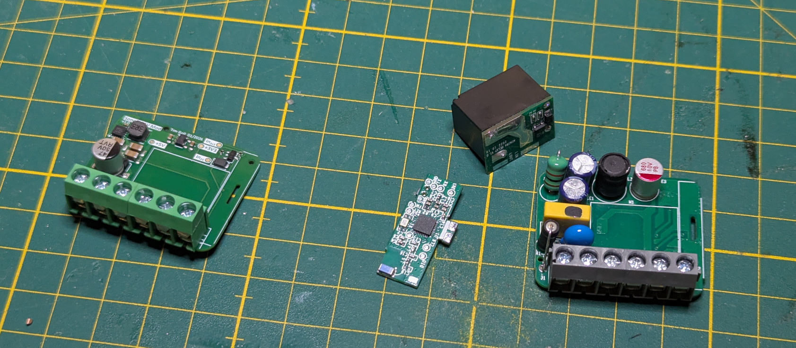
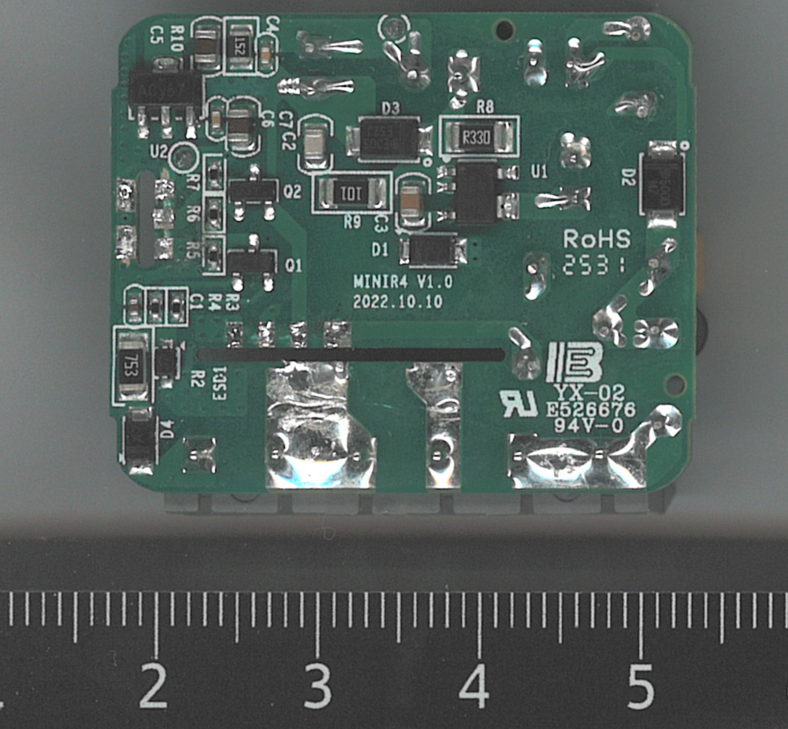
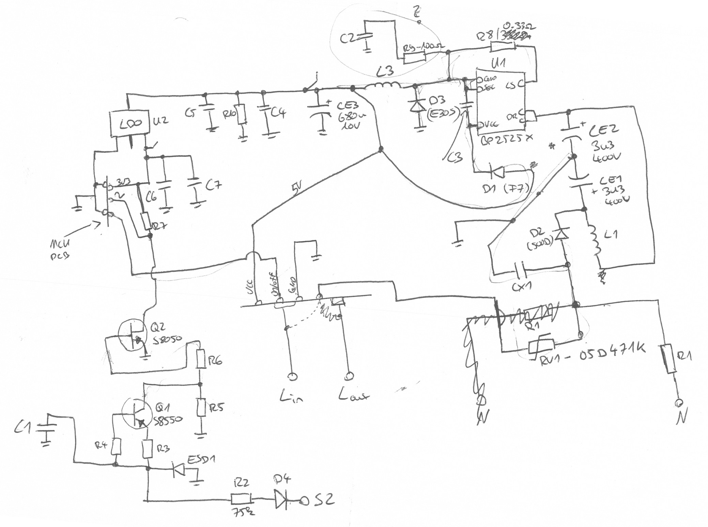
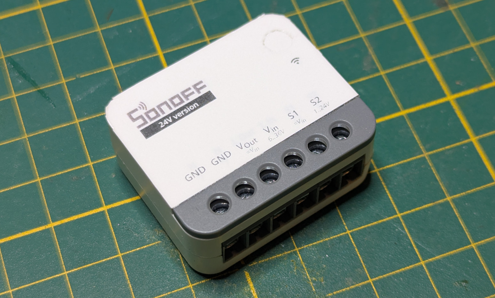

# Sonoff ZBMINIR2 24V Mod

I have a cupboard with an always-on `24V` supply in it, and I wanted to switch a light in there via Zigbee. At the same time it should still look and feel like a normal electrical installation, with a regular wall switch (a standard `230V` rated Merten switch) instead of some odd push button.

The [Sonoff ZBMINIR2](https://sonoff.tech/de-de/products/sonoff-zbmini-extreme-zigbee-smart-switch-zbminir2) does exactly that, just for `100-240V AC`. So instead of building something from scratch, I designed a replacement mainboard that lets it run on `24V DC`. Zigbee module, relay, enclosure and firmware all stay original.

The mod has been built, tested and in daily use since early 2026.

_(from left to right: new 24V mainboard, Zigbee module, relay module, original mainboard)_

## The Original Device

After taking the ZBMINIR2 apart, it turned out to be built from three separate boards:

- a Zigbee module based on the [EFR32MG21](https://www.silabs.com/wireless/zigbee/efr32mg21-series-2-socs)
- a relay module
- a mainboard with the mains power supply and the switch input circuitry

Only the mainboard deals with mains voltage. The other two modules just need a few low-voltage supply and signal lines, which makes this mod possible in the first place: replace one board, keep the rest.

_(original mainboard backside (flatbed scan with scale), MINIR4 V1.0)_

## Reverse Engineering

To know what the new board has to provide, I reverse-engineered the complete original circuit by hand. Some parts of the drawing don't fully make sense and there are probably some errors in it, but it's good enough to see what is going on.

_(hand-drawn reverse engineering of the original mainboard, flawed but good enough)_

The power supply is a [BP2525X](https://dfsimg1.hqewimg.com/group1/M00/1F/B4/wKhk7mGx0v6AeR8iAATcu9I75V8529.pdf), a non-isolated offline buck converter that creates `5V` for the relay, followed by an LDO for the `3.3V` rail of the Zigbee module.

The switch input is the interesting part. Since the supply is non-isolated, the logic ground is tied to mains, so the board can look at the switch terminal more or less directly. The input is half-wave rectified, current-limited by a big `75kΩ` resistor, clamped to a few volts by a protection diode, smoothed by a capacitor and then passed through two transistors into an active-low signal for the Zigbee module. No optocoupler, no extra supply.

Besides tracing the circuit, I measured the interface signals between the mainboard and the Zigbee module. The important finding: the switch input is **active low**. `230V` on the switch terminal results in `0V` at the controller, an open switch results in `3.3V`. My circuit had to replicate that polarity, otherwise the stock firmware would see the switch inverted. The relay drive requirements were taken from the relay's datasheet.

## The 24V Mainboard

The new board has the same outline, mounting points and module connectors as the original, so it drops straight into the stock enclosure.

### Power Supply

The `24V` input is converted to `5V` for the relay coil by a [LMQ66430](https://www.ti.com/lit/ds/symlink/lmq66430.pdf) synchronous buck converter running at `2.2MHz`. Honestly, a `36V`/`3A` converter is way too powerful for a relay and a Zigbee module, but it is tiny and needs very few external parts and I used it a few times in the past already. So it was used for convenience.

A [TLV757P](https://www.ti.com/lit/ds/symlink/tlv757p.pdf) LDO then generates the `3.3V` rail for the Zigbee module.

The `24V` rail has an `SMF24A` TVS diode for protection. This is tailored to a `24V` supply. Since the buck converter has quite a bit of margin left, the board could be used with higher voltages as well by adapting the protection diodes.

### Switch Input

At `24V DC` there is nothing to rectify and no `325V` peak to deal with, so the whole input circuit collapses into a single stage. The switch input drives an [MMBT5551](https://www.onsemi.com/pdf/datasheet/mmbt5551-d.pdf) NPN transistor through a `100kΩ` base resistor, protected by another `SMF24A`. The open collector has a `100kΩ` pull-up to `3.3V` and goes to the Zigbee module.

- `24V` on the input (switch on) pulls the controller pin to `0V`
- an open switch leaves the pin at `3.3V`

This is the same active-low behaviour as the original, so the Zigbee module can't tell the difference.

### Relay

The original relay module is reused. Its coil runs on the `5V` rail, and its contacts now switch `24V` to the output terminal instead of mains. Relay contacts are usually rated much lower for DC than for AC, so I checked the DC characteristics against my load. It is fine for my use case.

### Terminals

The terminal block keeps the original form factor:

| Terminal | Function        |
|----------|-----------------|
| 1        | switch input    |
| 2, 3     | `+24V`          |
| 4        | switched output |
| 5, 6     | `GND`           |

I also designed a new label for the enclosure that matches the 24V version.

_(the modified device with the custom label)_

## Result

The mod has been running without problems since early 2026. In Zigbee2MQTT and Home Assistant it shows up as a regular ZBMINIR2, since the firmware is untouched. The wall switch works like any normal light switch, just with `24V` behind it.

Schematic, PCB, production files and the label can be found in this repository.